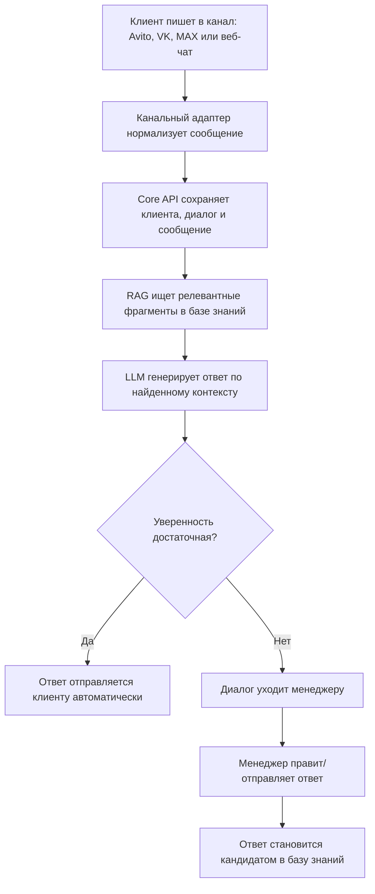
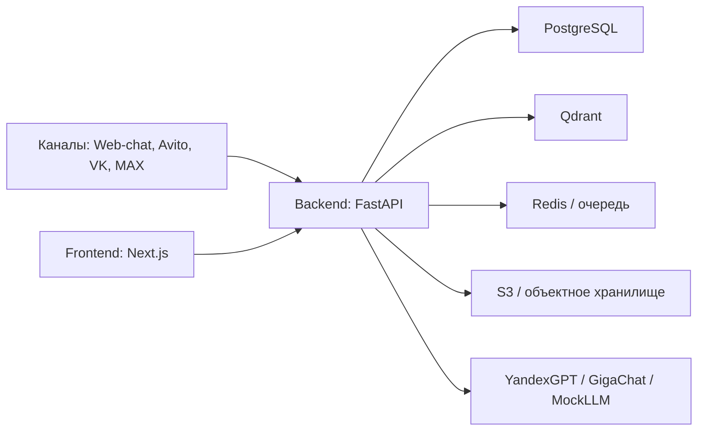

# Едино — AI-сотрудник в едином окне

**Едино** — SaaS-платформа для малого и среднего бизнеса, которая собирает обращения клиентов из разных каналов в один кабинет и помогает отвечать на них с помощью AI.

Продукт работает как “AI-сотрудник”: он читает базу знаний компании, отвечает на типовые вопросы клиентов, показывает источники ответа и передаёт сложные случаи живому менеджеру.

## Зачем нужен продукт

Малый бизнес часто теряет заявки не из-за отсутствия спроса, а из-за перегрузки коммуникаций:

- клиенты пишут в Avito, VK, мессенджеры и чат на сайте одновременно;
- менеджеры не успевают отвечать быстро, особенно вечером и в выходные;
- новые сотрудники долго учатся и могут отвечать неточно;
- информация о ценах, доставке, наличии и правилах хранится в разных местах;
- обычные кнопочные боты раздражают клиентов и не решают нестандартные вопросы.

**Едино** решает это через единое окно, базу знаний и AI-ответы под контролем человека.

## Что делает система

MVP продукта включает несколько ключевых частей:

1. **Единый inbox**
   Все обращения из подключённых каналов попадают в одну ленту диалогов.

2. **База знаний компании**
   Компания загружает документы: FAQ, прайсы, условия доставки, правила возврата, инструкции.

3. **AI-ответы по базе знаний**
   AI не отвечает “из головы”, а ищет релевантные фрагменты в базе знаний и строит ответ на их основе.

4. **Уверенность и эскалация**
   Если система не уверена в ответе или не нашла достаточный контекст, диалог передаётся менеджеру.

5. **Самообучение через менеджеров**
   Ответ менеджера может стать кандидатом на добавление в базу знаний. Так база постепенно растёт из реальных вопросов клиентов.

6. **Аналитика**
   Владелец видит долю автоответов, скорость реакции, причины эскалаций и использование лимитов тарифа.

## Как это работает

## Для кого

Основная аудитория — российский малый и средний бизнес с большим количеством повторяющихся обращений:

- продавцы на Avito;
- интернет-магазины;
- сервисные компании;
- клиники и бьюти-бизнес;
- агентства;
- локальные торговые компании.

Особенно полезно компаниям, у которых 50–500 диалогов в день и 1–10 менеджеров.

## Чем отличается

Фокус продукта — не просто “чат-бот”, а связка:

- единое окно для нескольких каналов;
- ответы по базе знаний компании;
- прозрачность источников ответа;
- метрика уверенности;
- передача человеку при риске ошибки;
- пополнение базы знаний из ответов менеджеров;
- стек, ориентированный на российский рынок и хранение данных в РФ.

## Архитектура

Проект разделён на несколько репозиториев:

- [`Backend`](https://github.com/Project-AI-manager/Backend) — API, БД, RAG, интеграции каналов, фоновые задачи.
- [`Frontend`](https://github.com/Project-AI-manager/Frontend) — веб-интерфейс: лендинг, кабинет, inbox, база знаний, аналитика, настройки.
- [`Main`](https://github.com/Project-AI-manager/Main) — описание продукта и верхнеуровневая документация проекта.

Высокоуровневая схема:

## Планируемый стек

### Backend

- Python 3.12
- FastAPI
- Pydantic v2
- SQLAlchemy 2.x async
- Alembic
- PostgreSQL
- Redis
- ARQ / async workers
- Qdrant
- S3-compatible storage: Yandex Object Storage / MinIO
- JWT + Argon2
- httpx
- structlog

### AI / RAG

- RAG-пайплайн: чанкинг → эмбеддинги → поиск → генерация ответа
- Qdrant для векторного поиска
- LLM-provider interface
- MockLLM для локальной разработки
- YandexGPT / GigaChat как целевые LLM-провайдеры
- локальные или облачные embeddings

### Frontend

- Next.js
- React
- TypeScript
- Tailwind CSS
- TanStack Query
- Axios
- Zustand
- React Hook Form
- Zod
- Orval для генерации API-клиента из OpenAPI

### Infrastructure

- Docker / docker-compose для локальной разработки
- PostgreSQL, Redis, Qdrant, MinIO локально
- Yandex Cloud как целевая инфраструктура
- GitHub Actions для CI

## MVP-экраны

В MVP интерфейс намеренно компактный:

- лендинг;
- вход и регистрация;
- onboarding;
- диалоги / inbox;
- база знаний;
- аналитика;
- каналы;
- настройки;
- профиль;
- legal-страницы.

Тарифы и описание продукта находятся секциями на лендинге, чтобы не раздувать первую версию.

## Текущий статус

Проект находится на стадии инициализации MVP:

- создан каркас backend;
- описана инициальная схема БД через Alembic;
- создан каркас frontend;
- добавлены основные страницы кабинета;
- подготовлены demo-данные для проверки интерфейса;
- AI-провайдеры и внешние каналы пока подключаются через интерфейсы и заглушки.

## Ближайшие шаги

1. Реализовать настоящую регистрацию и вход.
2. Подключить PostgreSQL и применить миграции.
3. Реализовать загрузку документов базы знаний.
4. Собрать первый end-to-end RAG-сценарий: документ → вопрос → ответ → источники.
5. Подключить веб-чат как первый канал.
6. Реализовать очередь обработки входящих сообщений.
7. После web-chat подключать Avito и VK.

## Рабочее название

Текущее рабочее название продукта — **«Едино»**.

Название можно заменить позже, но продуктовая идея остаётся прежней: много каналов, одна база знаний, один AI-сотрудник и человек на контроле.
