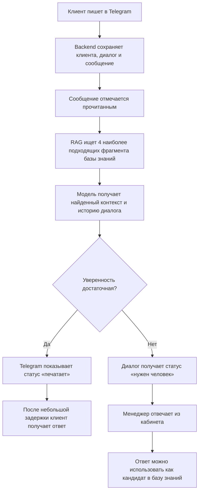
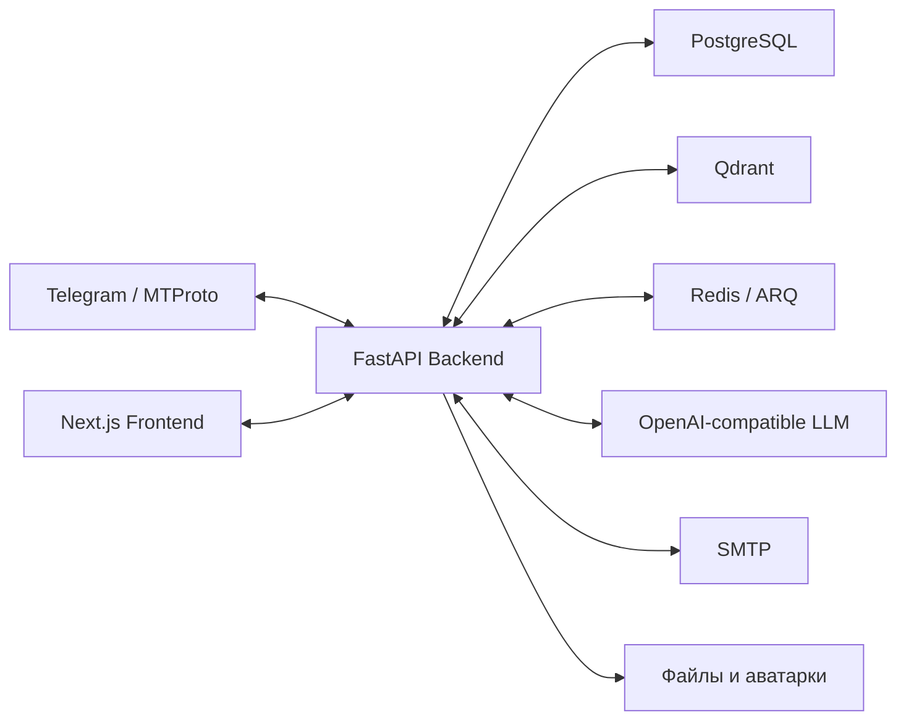

# Автопилот

**Автопилот** — AI-менеджер для общения с клиентами. Сервис принимает обращения из подключённых каналов, помогает вести диалоги в едином кабинете, отвечает по базе знаний компании и передаёт нестандартные запросы человеку.

- Сайт: [автопилот.space](https://автопилот.space)
- Frontend: [Project-AI-manager/Frontend](https://github.com/Project-AI-manager/Frontend)
- Backend: [Project-AI-manager/Backend](https://github.com/Project-AI-manager/Backend)

> Проект находится на стадии рабочего MVP. Полный пользовательский сценарий реализован для Telegram. Карточки других каналов показывают направление развития продукта и не означают, что их интеграция уже готова.

## Что уже умеет продукт

- регистрация, вход, подтверждение email и восстановление пароля;
- одноразовое обучение по интерфейсу для нового пользователя;
- подключение личного Telegram-аккаунта через OTP и 2FA;
- единый список диалогов, сообщения, вложения, аватарки и статусы доставки;
- загрузка нескольких файлов и отправка текста вместе с вложениями;
- база знаний из PDF, DOCX, XLSX, TXT и Markdown;
- переиндексация документов и семантический поиск по базе знаний;
- автоматические ответы с настраиваемым порогом уверенности;
- передача запроса менеджеру, если надёжного ответа нет;
- кандидаты в базу знаний на основе реальных ответов менеджера;
- аналитика по обращениям, сообщениям, автоответам, эскалациям и токенам;
- подробная выгрузка аналитики в XLSX за выбранный период;
- email-уведомления о событиях, требующих внимания человека.

## Основной сценарий

```mermaid
flowchart TD
    A["Клиент пишет в Telegram"] --> B["Backend сохраняет клиента, диалог и сообщение"]
    B --> C["Сообщение отмечается прочитанным"]
    C --> D["RAG ищет 4 наиболее подходящих фрагмента базы знаний"]
    D --> E["Модель получает найденный контекст и историю диалога"]
    E --> F{"Уверенность достаточная?"}
    F -->|Да| G["Telegram показывает статус «печатает»"]
    G --> H["После небольшой задержки клиент получает ответ"]
    F -->|Нет| I["Диалог получает статус «нужен человек»"]
    I --> J["Менеджер отвечает из кабинета"]
    J --> K["Ответ можно использовать как кандидат в базу знаний"]
```

AI не должен придумывать отсутствующие факты. Порог уверенности задаётся в настройках: чем он выше, тем осторожнее система отвечает автоматически. Проверка учитывает релевантность найденных фрагментов и результат генерации, а не только одно число косинусного сходства.

## Репозитории

| Репозиторий | Назначение | Основной стек |
| --- | --- | --- |
| [Main](https://github.com/Project-AI-manager/Main) | Общее описание продукта и навигация по проекту | Markdown |
| [Backend](https://github.com/Project-AI-manager/Backend) | API, данные, RAG, Telegram, email, аналитика и фоновые процессы | Python 3.12, FastAPI, PostgreSQL, Qdrant, Redis |
| [Frontend](https://github.com/Project-AI-manager/Frontend) | Лендинг и кабинет владельца/менеджера | Next.js 16, React 19, TypeScript, Tailwind CSS 4 |

## Архитектура

```mermaid
flowchart LR
    Telegram["Telegram / MTProto"] <--> Backend["FastAPI Backend"]
    Browser["Next.js Frontend"] <--> Backend
    Backend <--> DB["PostgreSQL"]
    Backend <--> VectorDB["Qdrant"]
    Backend <--> Queue["Redis / ARQ"]
    Backend <--> LLM["OpenAI-compatible LLM"]
    Backend <--> SMTP["SMTP"]
    Backend --> Files["Файлы и аватарки"]
```

Для локальной разработки backend также поддерживает SQLite и встроенное хранилище Qdrant. Это упрощает проверку продукта без полного набора контейнеров, но не заменяет production-конфигурацию.

## Текущая публикация

Frontend развёрнут на Vercel и доступен по адресу [автопилот.space](https://автопилот.space). Backend пока запускается локально и временно публикуется через HTTPS-туннель. Поэтому полный сценарий на публичном сайте доступен только пока локальный backend и туннель работают.

Адрес временного туннеля меняется после его перезапуска. Новый URL нужно указать во frontend-переменной `NEXT_PUBLIC_API_URL` и разрешить домен frontend в `CORS_ORIGINS` backend.

## Продуктовые принципы

1. **Ответы по данным компании.** База знаний остаётся главным источником фактов.
2. **Человек сохраняет контроль.** Рискованные запросы передаются менеджеру.
3. **Контекст не теряется.** При ответе учитывается история общения с клиентом.
4. **Интерфейс объясняет состояние.** Пользователь видит доставку сообщений, эскалации и результат обновления базы.
5. **Оплата по использованию.** Планируемая коммерческая модель основана на фактически потраченных токенах без обязательной абонентской платы. Платёжный контур ещё не заявлен как завершённая функция MVP.

## Ближайшие направления

- разместить backend в постоянной облачной инфраструктуре;
- добавить production-хранилище пользовательских файлов;
- подключить новые каналы связи после стабилизации Telegram-сценария;
- расширить учёт токенов до прозрачного биллинга;
- развивать автоматическое пополнение базы знаний из успешных диалогов;
- усилить мониторинг, резервное копирование и эксплуатационную диагностику.

## Работа с ветками

Backend и frontend развиваются раздельно:

- backend-задачи: `task_1xx`;
- frontend-задачи: `task_2xx`;
- одна задача — отдельная ветка и отдельный pull request;
- секреты, локальные базы, загруженные файлы и журналы запуска не коммитятся.

Подробные команды запуска, конфигурация и проверки находятся в README соответствующего репозитория.
